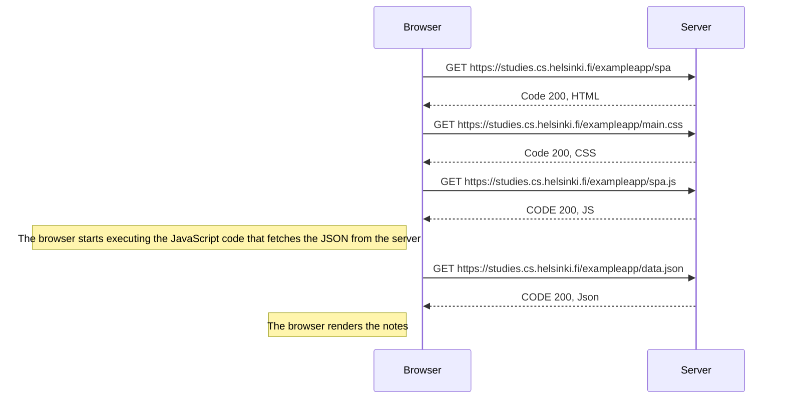

```mermaid
sequenceDiagram
Browser->>Server: GET https://studies.cs.helsinki.fi/exampleapp/spa
Server-->>Browser: Code 200, HTML

Browser->>Server: GET https://studies.cs.helsinki.fi/exampleapp/main.css
Server-->>Browser: Code 200, CSS


Browser->>Server: GET https://studies.cs.helsinki.fi/exampleapp/spa.js
Server-->>Browser: CODE 200, JS

Note left of Browser: The browser starts executing the JavaScript code that fetches the JSON from the server

Browser->>Server: GET https://studies.cs.helsinki.fi/exampleapp/data.json
Server-->>Browser: CODE 200, Json

Note left of Browser: The browser renders the notes
```
