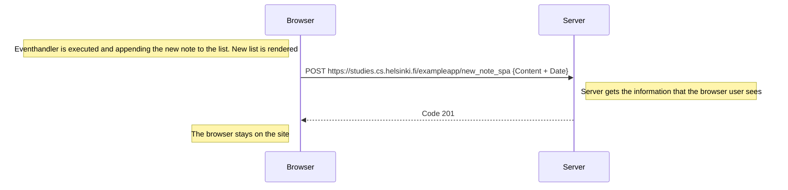

```mermaid
sequenceDiagram
Note left of Browser: Eventhandler is executed and appending the new note to the list. New list is rendered

Browser->>Server: POST https://studies.cs.helsinki.fi/exampleapp/new_note_spa {Content + Date}
Note right of Server: Server gets the information that the browser user sees
Server-->>Browser: Code 201

Note left of Browser: The browser stays on the site
```
