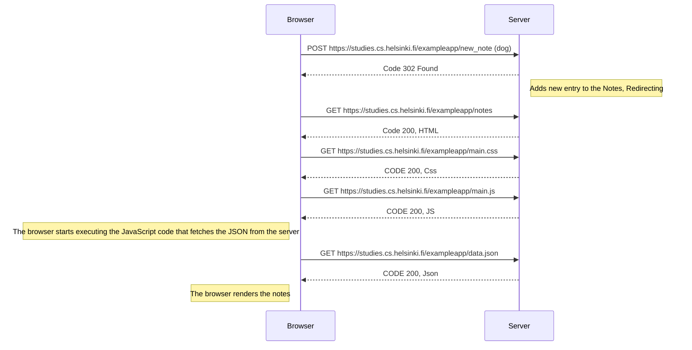

```mermaid
sequenceDiagram
Browser->>Server: POST https://studies.cs.helsinki.fi/exampleapp/new_note (dog)
Server-->>Browser: Code 302 Found

Note right of Server: Adds new entry to the Notes, Redirecting

Browser->>Server: GET https://studies.cs.helsinki.fi/exampleapp/notes
Server-->>Browser: Code 200, HTML

Browser->>Server: GET https://studies.cs.helsinki.fi/exampleapp/main.css
Server-->>Browser: CODE 200, Css

Browser->>Server: GET https://studies.cs.helsinki.fi/exampleapp/main.js
Server-->>Browser: CODE 200, JS

Note left of Browser: The browser starts executing the JavaScript code that fetches the JSON from the server

Browser->>Server: GET https://studies.cs.helsinki.fi/exampleapp/data.json
Server-->>Browser: CODE 200, Json

Note left of Browser: The browser renders the notes
```
